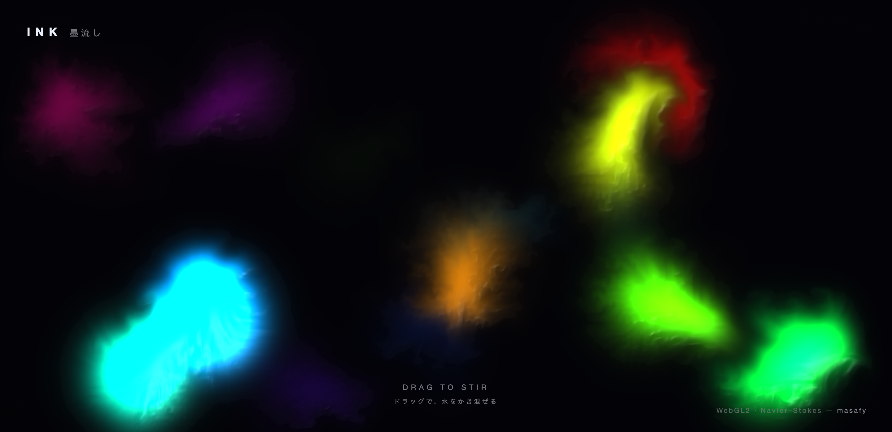
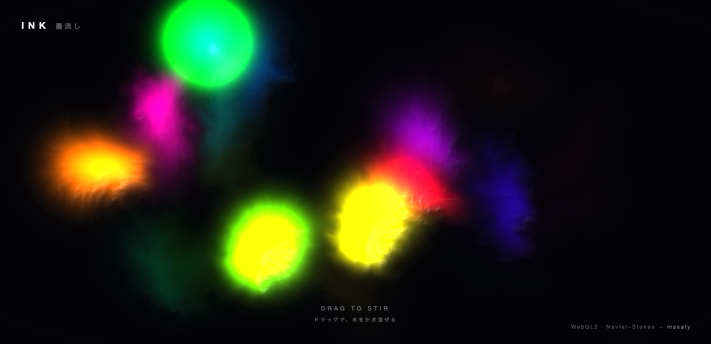

# INK — 墨流し

A full-screen, reactive GPU fluid. Move the cursor to stir swirling ribbons of
colour through a dark pool of water — a real-time Navier–Stokes simulation
running entirely on the GPU in WebGL2.

**Live:** https://ink.1qaz.jp



---

## What it is

INK is a "stable fluids" solver (Jos Stam / GPU Gems) implemented as a chain of
fragment-shader passes ping-ponging between floating-point framebuffers. Each
frame the velocity field is advected, made divergence-free with a Jacobi
pressure solve, and given its swirl back with vorticity confinement; a separate
dye field is carried along to colour the flow.

There is no library doing the heavy lifting — just raw WebGL2 and GLSL, ~16 KB
of JavaScript.



## How it reacts

- **Move / drag** anywhere to inject velocity and colour. Plain hover stirs the
  water in a slowly cycling rainbow; press and drag for a fresh hue.
- **Touch** is fully supported, including multiple fingers at once.
- When left alone, gentle ambient puffs keep the pool alive and inviting.

## The solver, pass by pass

Each simulation step runs these shader programs in order (see `src/shaders.js`):

| Pass | Purpose |
|------|---------|
| curl + vorticity | measure and re-inject swirl the solver would otherwise damp |
| divergence | how much the velocity field is compressing / expanding |
| pressure (×20 Jacobi) | solve the pressure that cancels that divergence |
| gradient subtract | make the velocity field incompressible |
| advection | carry velocity and dye along the flow |
| splat | add a soft gaussian of velocity + colour at the pointer |
| display | composite dye with embossed shading + a soft glow |

## Tech stack

- **WebGL2** + **GLSL ES** (half-float render targets, `EXT_color_buffer_float`)
- **Vite** build — pure static output, no backend, no dependencies
- Display adds gradient-based shading and a cheap bloom so the flat fluid reads
  as a glowing, liquid surface

## Project structure

```
index.html      # canvas + brand / hint / credit overlay
src/
  main.js       # boot the solver, fade the hint on first stir
  fluid.js      # the WebGL2 solver: FBOs, programs, step loop, pointer input
  shaders.js    # every GLSL pass
  style.css     # overlay / typography / vignette
```

## Run locally

```bash
npm install
npm run dev      # http://localhost:5173
npm run build    # → dist/  (static, deploy anywhere)
```

Requires a WebGL2-capable browser (any recent Chrome / Safari / Firefox / Edge).

---

Built by [masafy](https://github.com/masafykun), part of a small series of
WebGL experiments alongside
[VOYAGE](https://github.com/masafykun/voyage),
[ORB](https://github.com/masafykun/kodou-orb) and
[FLUX](https://github.com/masafykun/yuragi-flux).
